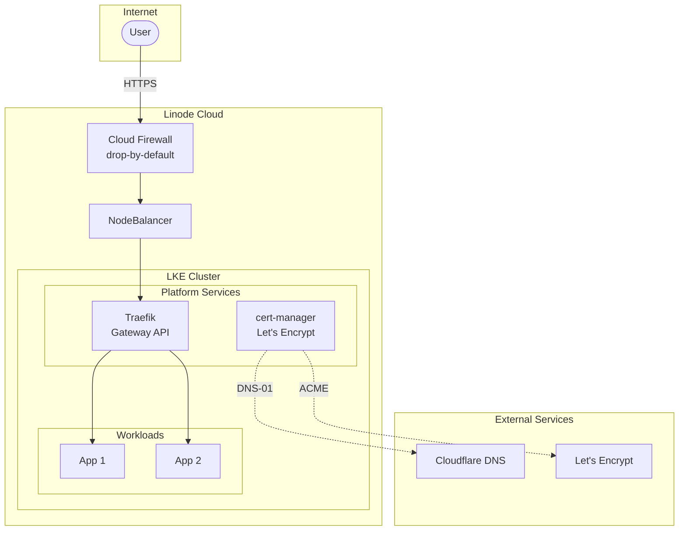
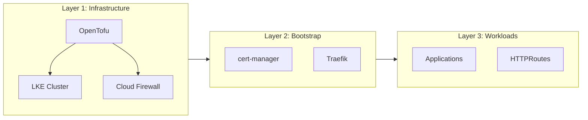
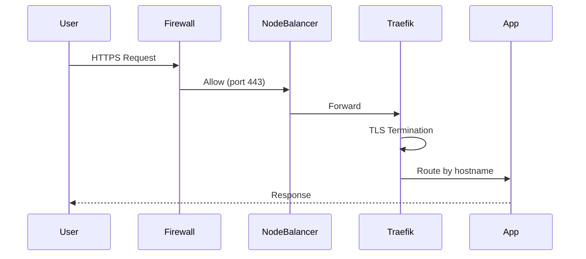

# LKE Sandbox

A production-ready Kubernetes platform on Linode Kubernetes Engine (LKE) using OpenTofu for infrastructure-as-code and Gateway API for modern ingress routing.

## Overview

This project provisions a complete Kubernetes platform with:

- **LKE Cluster** with Cloud Firewall security
- **Traefik** as Gateway API controller
- **cert-manager** with Let's Encrypt wildcard certificates
- **Cloudflare DNS** integration for DNS-01 challenges

Domain: `*.sandbox.knorr.casa`

## Architecture



### Three-Layer Architecture



## Project Structure

```
lke-sandbox/
├── tofu/                          # Infrastructure as Code
│   ├── modules/
│   │   ├── lke-cluster/          # Reusable LKE cluster module
│   │   └── firewall/             # Cloud Firewall module
│   └── environments/
│       └── sandbox/              # Sandbox environment config
├── bootstrap/                     # Platform services
│   ├── cert-manager/             # ClusterIssuer & Certificate
│   └── traefik/                  # Helm values for Gateway API
└── docs/                          # Detailed guides
```

## Quick Start

### Prerequisites

- [OpenTofu](https://opentofu.org/) >= 1.6.0
- [kubectl](https://kubernetes.io/docs/tasks/tools/)
- [Helm](https://helm.sh/)
- Linode API token (Read/Write: Linodes, LKE, NodeBalancers, Firewalls, IPs)
- Cloudflare API token (Zone DNS Edit for your domain)

### 1. Deploy Infrastructure

```bash
cd tofu/environments/sandbox
export LINODE_TOKEN="your-token"

tofu init
tofu apply

export KUBECONFIG=$(tofu output -raw kubeconfig_path)
kubectl get nodes
```

### 2. Install Platform Services

```bash
# Gateway API CRDs
kubectl apply -f https://github.com/kubernetes-sigs/gateway-api/releases/download/v1.2.0/standard-install.yaml

# cert-manager
helm upgrade --install cert-manager jetstack/cert-manager \
  --namespace cert-manager --create-namespace \
  --set crds.enabled=true --wait

# Cloudflare secret for DNS-01
kubectl create secret generic cloudflare-api-token \
  --namespace cert-manager \
  --from-literal=api-token=$CLOUDFLARE_API_TOKEN

# Apply cert-manager resources
kubectl apply -f bootstrap/cert-manager/

# Traefik with Gateway API
helm upgrade --install traefik traefik/traefik \
  --namespace traefik --create-namespace \
  --values bootstrap/traefik/values.yaml --wait
```

### 3. Deploy Workloads

Create an `HTTPRoute` pointing to `traefik-gateway` in the `traefik` namespace:

```yaml
apiVersion: gateway.networking.k8s.io/v1
kind: HTTPRoute
metadata:
  name: my-app
spec:
  parentRefs:
    - name: traefik-gateway
      namespace: traefik
  hostnames:
    - "myapp.sandbox.knorr.casa"
  rules:
    - backendRefs:
        - name: my-app-service
          port: 80
```

## Traffic Flow



## Configuration

### Environment Variables

| Variable | Description |
|----------|-------------|
| `LINODE_TOKEN` | Linode API token |
| `CLOUDFLARE_API_TOKEN` | Cloudflare API token for DNS-01 |
| `KUBECONFIG` | Path to kubeconfig (auto-generated) |

### Cluster Settings

| Setting | Default |
|---------|---------|
| Region | us-west |
| Kubernetes Version | 1.34 |
| Node Pool | 2x g6-standard-2 |

## Cost Estimate

| Resource | Monthly Cost |
|----------|--------------|
| LKE Nodes (2x g6-standard-2) | $48 |
| NodeBalancer | $10 |
| **Total** | **~$58** |

## Documentation

See the `docs/` directory for detailed guides:

### Getting Started
- [Prerequisites](docs/01-prerequisites.md) - Tools and tokens setup
- [LKE Cluster](docs/02-lke-cluster.md) - Infrastructure provisioning
- [Firewall](docs/03-firewall.md) - Security configuration
- [Platform](docs/04-platform.md) - cert-manager and Traefik setup
- [Bootstrap Guide](docs/BOOTSTRAP.md) - Secrets-first GitOps deployment

### Reference
- [Architecture](docs/ARCHITECTURE.md) - Component architecture and design decisions
- [Configuration](docs/CONFIGURATION.md) - All variables, settings, and options
- [Golden Pathway](docs/GOLDEN-PATHWAY.md) - Three-layer architecture philosophy
- [Operations](docs/OPERATIONS.md) - Day-2 operations and troubleshooting

## License

MIT License - see [LICENSE](LICENSE) for details.